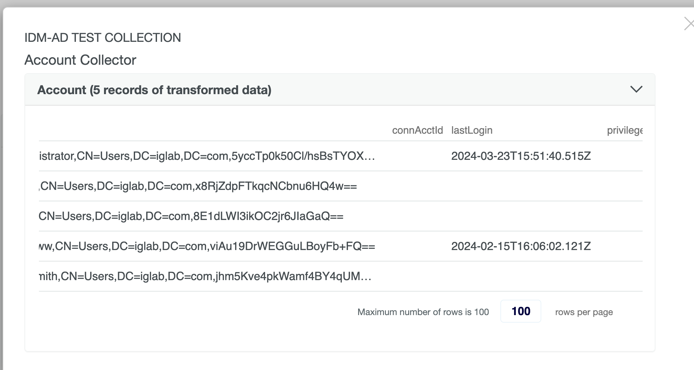
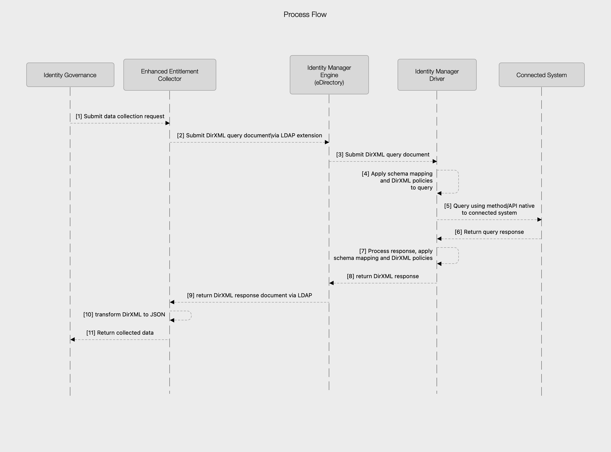

# Enhanced IDM collector

This code implements a custom [collector](https://www.microfocus.com/documentation/identity-governance/4.2/user-guide/b1e56ljh.html) for [NetIQ Identity Governance](https://www.opentext.com/products/identity-governance-and-administration) (IG) by OpenText. It allows IG to to query account and permission data from systems provisioned by the [NetIQ Identity Manager](https://www.opentext.com/products/netiq-identity-manager) product.
Queries are submitted to the Identity Manager (DirXML) engine and the results are returned to IG. This collector can be used in place of the [IDM Entitlement Collector](https://www.microfocus.com/documentation/identity-governance/4.2/user-guide/identity-manager.html#t4hs7k7kq1v4-2) that ships with IG.
The stock entitlement collector collects a limited set of attributes and only supports specific DirXML drivers. This collector is more generic and can be used with any DirXML driver. This collector will work with the stock [IDM Entitlement Fulfillment Target](https://www.microfocus.com/documentation/identity-governance/4.2/user-guide/identity-manager.html#t4hs8b4uk1ev-2) in IG if the appropriate attributes are mapped.

## Support

This code is provided as-is and is not supported by OpenText/NetIQ. Paid support for this code is available from [Idenhuas Consulting](https://idenhaus.com).

If you would like to contribute to this project, please fork the repository and submit a pull request.

Binary builds are available [here](https://software.pointbluetech.com/pb/oss/eec/v1.0/).

## Use cases

Example use cases for this driver include:

* Collecting accounts where you need more than association, id, description, and active status.
* Collecting permission assignments in the connected system for a driver that is not using IDM entitlements.

An example is collecting accounts from Active Directory and returning the `lastLogon` attribute. This attribute is not returned by the stock entitlement collector. Note that this value is transformed from the raw LDAP value using a collector transform.


See the example at [examples/Active Directory](examples/Active%20Directory) for more information on how to use this collector.

## Collection process

The full collection process is shown in the following diagram:


Currently, the driver needs to explicitly return an `id` attribute if you want to use the OOTB mappings provided by the stock entitlement fulfillment target. You will need to add this attribute via policy if your driver shim does not return it.

In addition to any attributes returned by the driver, this collector will add `association`, `class`, and `entitlementDn` to the returned JSON objects.
The `id2` is the `src-dn` attribute of the instance. The `entitlementDn` is the dn configured in IG. This is returned because the stock fulfillment code depends on it.
The `class` is the object class of the returned instance element.

This collector does NOT use the `entitlementDn` in any other way and the entitlement does not need to exist in eDirectory if you are only collecting data.

If you enter only a search class, a basic DirXML query that includes no [`read-attr`](https://www.netiq.com/documentation/identity-manager-developer/dtd-documentation/ndsdtd/read-attr.html) or [`search-attr`](https://www.netiq.com/documentation/identity-manager-developer/dtd-documentation/ndsdtd/search-attr.html) is generated. You will get back whatever your driver shim returns by default.
If you enter a custom query, that query will be used.  Once again, this collector does not try to use any of the entitlement configuration from eDirectory when generating queries. This is intentional.

The stock entitlement collector transforms the eDirectory GUID to a hex string. This collector does not do that. The GUID is returned as a Base64 encoded byte array. This is intentional. You can perform the transformation in the collector mapping using the following JavaScript code:

```js
function base64DecodeToBytes(input) {
    const keyStr = "ABCDEFGHIJKLMNOPQRSTUVWXYZabcdefghijklmnopqrstuvwxyz0123456789+/=";
    let output = [];
    let chr1, chr2, chr3;
    let enc1, enc2, enc3, enc4;
    let i = 0;

    input = input.replace(/[^A-Za-z0-9\+\/\=]/g, "");

    while (i < input.length) {
        enc1 = keyStr.indexOf(input.charAt(i++));
        enc2 = keyStr.indexOf(input.charAt(i++));
        enc3 = keyStr.indexOf(input.charAt(i++));
        enc4 = keyStr.indexOf(input.charAt(i++));

        chr1 = (enc1 << 2) | (enc2 >> 4);
        chr2 = ((enc2 & 15) << 4) | (enc3 >> 2);
        chr3 = ((enc3 & 3) << 6) | enc4;

        output.push(chr1);

        if (enc3 != 64) {
            output.push(chr2);
        }
        if (enc4 != 64) {
            output.push(chr3);
        }
    }

    return output;
}

function guidToString(guid) {
    if (!guid || guid.length === 0)
        return "";

    let decoded = base64DecodeToBytes(guid);
    let hex = '';
    for (let i = 0; i < decoded.length; i++) {
        let byte = decoded[i];
        hex += ('0' + (byte & 0xFF).toString(16)).slice(-2);
    }
    let guidStr = hex.toUpperCase();
    return guidStr;
}
outputValue = guidToString(inputValue);
```

This release requires LDAPS and does not validate the LDAP server certificate by default.

## Build instructions

The following dependencies are required to build the project:

* Daas-SDKServer.jar
* dirxml_misc.jar
* jettison-1.3.7.jar
* ldap.jar
* logging-common-1.4.2-57.jar
* slf4j-api-1.7.22.jar
* XDS-4.8.0.0.jar

All except the Daas SDK are available from IG 4.2. The Daas SDK is hard to find but it is linked from the [IG 3.6 release notes](https://www.netiq.com/documentation/identity-governance-36/releasenotes/data/releasenotes.html#t45a9l5omsw0). You can satisfy the dependencies from the SDK with additional jars from IG 4.2 if you need to.
