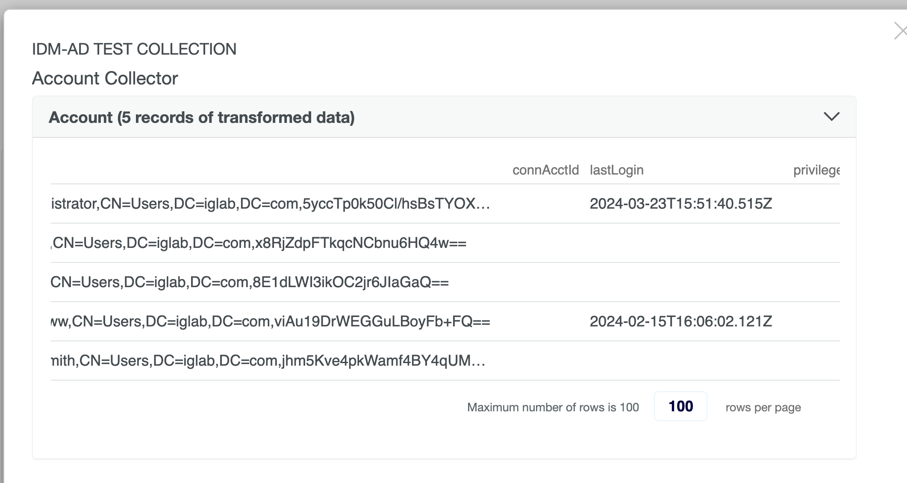
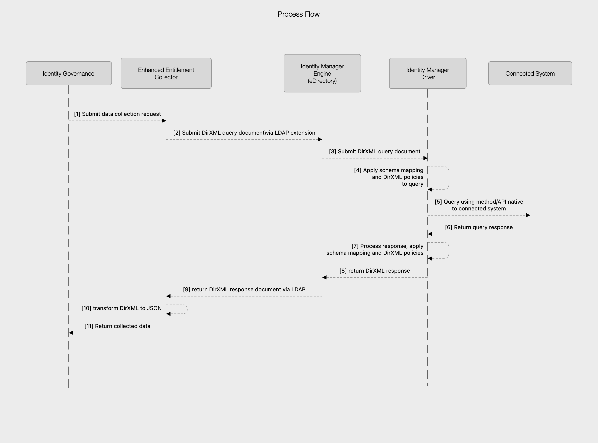

# Enhanced IDM collector

This code implements a custom [collector](https://www.microfocus.com/documentation/identity-governance/4.2/user-guide/b1e56ljh.html) for [NetIQ Identity Governance](https://www.opentext.com/products/identity-governance-and-administration) (IG) by OpenText. It allows IG to to query account and permission data from systems provisioned by the [NetIQ Identity Manager](https://www.opentext.com/products/netiq-identity-manager) product.
Queries are submitted to the Identity Manager (DirXML) engine and the results are returned to IG. This collector can be used in place of the [IDM Entitlement Collector](https://www.microfocus.com/documentation/identity-governance/4.2/user-guide/identity-manager.html#t4hs7k7kq1v4-2) that ships with IG.
The stock entitlement collector collects a limited set of attributes and only supports specific DirXML drivers. This collector is more generic and can be used with any DirXML driver. This collector will work with the stock [IDM Entitlement Fulfillment Target](https://www.microfocus.com/documentation/identity-governance/4.2/user-guide/identity-manager.html#t4hs8b4uk1ev-2) in IG if the appropriate attributes are mapped.

## Support

This code is provided as-is and is not supported by OpenText/NetIQ. Paid support for this code is available from [Idenhuas Consulting](https://idenhaus.com).

If you would like to contribute to this project, please fork the repository and submit a pull request.

Binary builds are available on the [GitHub Releases page](https://github.com/PointBlueTechnology/EnhancedIDMCollector/releases).

## Use cases

Example use cases for this driver include:

* Collecting accounts where you need more than association, id, description, and active status.
* Collecting permission assignments in the connected system for a driver that is not using IDM entitlements.

An example is collecting accounts from Active Directory and returning the `lastLogon` attribute. This attribute is not returned by the stock entitlement collector. Note that this value is transformed from the raw LDAP value using a collector transform.


See the example at [examples/Active Directory](examples/Active%20Directory) for more information on how to use this collector.

## Collection process

The full collection process is shown in the following diagram:


Currently, the driver needs to explicitly return an `id` attribute if you want to use the OOTB mappings provided by the stock entitlement fulfillment target. You will need to add this attribute via policy if your driver shim does not return it.

In addition to any attributes returned by the driver, this collector will add `association`, `class`, and `entitlementDn` to the returned JSON objects.
The `id2` is the `src-dn` attribute of the instance. The `entitlementDn` is the dn configured in IG. This is returned because the stock fulfillment code depends on it.
The `class` is the object class of the returned instance element. Note that you may need to update to the latest version of the Account Collector template.

Fulfillment for Account provisioning requires an "IDM Account ID" attribute. This a static value that is used as the path portion of the DirXML-Entitlement DN. this value is used as the path portion of the DirXML-EntitlementRef value for account entitlements.
For example, Active Directory uses the domain name. You can now configure a value for this attribute in Account Collector template. This value will be returned in the JSON as "idmAccountID". Feel free to map any other attribute to this value if you need to for you specific driver.

This collector does NOT use the `entitlementDn` in any other way and the entitlement does not need to exist in eDirectory if you are only collecting data.

If you enter only a search class, a basic DirXML query that includes no [`read-attr`](https://www.netiq.com/documentation/identity-manager-developer/dtd-documentation/ndsdtd/read-attr.html) or [`search-attr`](https://www.netiq.com/documentation/identity-manager-developer/dtd-documentation/ndsdtd/search-attr.html) is generated. You will get back whatever your driver shim returns by default.
If you enter a custom query, that query will be used.  Once again, this collector does not try to use any of the entitlement configuration from eDirectory when generating queries. This is intentional.

The stock entitlement collector transforms the eDirectory GUID to a hex string. This collector does not do that. The GUID is returned as a Base64 encoded byte array. This is intentional. You can perform the transformation in the collector mapping using the following JavaScript code:

```js
function base64DecodeToBytes(input) {
    const keyStr = "ABCDEFGHIJKLMNOPQRSTUVWXYZabcdefghijklmnopqrstuvwxyz0123456789+/=";
    let output = [];
    let chr1, chr2, chr3;
    let enc1, enc2, enc3, enc4;
    let i = 0;

    input = input.replace(/[^A-Za-z0-9\+\/\=]/g, "");

    while (i < input.length) {
        enc1 = keyStr.indexOf(input.charAt(i++));
        enc2 = keyStr.indexOf(input.charAt(i++));
        enc3 = keyStr.indexOf(input.charAt(i++));
        enc4 = keyStr.indexOf(input.charAt(i++));

        chr1 = (enc1 << 2) | (enc2 >> 4);
        chr2 = ((enc2 & 15) << 4) | (enc3 >> 2);
        chr3 = ((enc3 & 3) << 6) | enc4;

        output.push(chr1);

        if (enc3 != 64) {
            output.push(chr2);
        }
        if (enc4 != 64) {
            output.push(chr3);
        }
    }

    return output;
}

function guidToString(guid) {
    if (!guid || guid.length === 0)
        return "";

    let decoded = base64DecodeToBytes(guid);
    let hex = '';
    for (let i = 0; i < decoded.length; i++) {
        let byte = decoded[i];
        hex += ('0' + (byte & 0xFF).toString(16)).slice(-2);
    }
    let guidStr = hex.toUpperCase();
    return guidStr;
}
outputValue = guidToString(inputValue);
```

This release requires LDAPS and does not validate the LDAP server certificate by default.

## Build instructions

The project builds with [Apache Maven](https://maven.apache.org/) and a JDK 11 or newer. The build
targets Java 11 bytecode (`maven.compiler.release=11`).

### Quick start

```sh
# 1. One-time: install the proprietary jars into the project-local repo (see below)
./install-local-deps.sh

# 2. Build
mvn clean package
```

The build produces `target/EnhancedEntitlementCollector.jar`.

### Project layout

The project uses the standard Maven directory layout:

| Path | Contents |
| --- | --- |
| `src/main/java` | Collector and fulfillment source |
| `src/main/resources` | Runtime JSON resources bundled into the jar |
| `src/test/java` | Offline `main()`-based test jigs (see [below](#running-the-offline-test-jigs)) |
| `src/test/resources` | Fixtures used by the jigs |
| `repo/` | Project-local Maven repository (see [Dependencies](#dependencies)) |
| `install-local-deps.sh` | Installs the proprietary jars into `repo/` |

### Dependencies

All dependencies resolve from a project-local Maven repository under `./repo` — the build does **not**
require Maven Central for the application's own dependencies (Maven still downloads its own build
plugins from Central on first run).

The open-source dependencies (`org.slf4j:slf4j-api`, `org.codehaus.jettison:jettison`) are committed
to `./repo`. The proprietary OpenText/NetIQ jars are **not** redistributable and are git-ignored, so
you must install them locally once before building:

| Coordinate | Jar |
| --- | --- |
| `com.opentext.ig:daas-sdkserver:3.6.1` | DaaS-SDKServer.jar |
| `com.netiq.dirxml:xds:4.8.0.0` | XDS-4.8.0.0.jar |
| `com.netiq.dirxml:dirxml-misc:4.8.3.0` | dirxml_misc.jar |
| `com.netiq.ism:logging-common:1.4.2-57` | logging-common-1.4.2-57.jar |
| `com.novell:ldap:1.0` | ldap.jar |

All except the DaaS SDK are available from IG 4.2. The DaaS SDK is hard to find but it is linked from
the [IG 3.6 release notes](https://www.netiq.com/documentation/identity-governance-36/releasenotes/data/releasenotes.html#t45a9l5omsw0).
You can satisfy the dependencies from the SDK with additional jars from IG 4.2 if you need to.

All dependencies are declared with `provided` scope: they are supplied by the IG/IDM runtime and are
therefore **not** bundled into the collector jar.

### Installing the proprietary jars

Place the jars listed above in a directory (default `~/Dev/igCollectorDependencies`) and run:

```sh
./install-local-deps.sh [SOURCE_DIR]
```

The script installs each jar into `./repo` under the coordinates the build expects. You only need to
do this once per checkout (or whenever a dependency version changes). The script is idempotent and
also reinstalls the open-source jars, which is harmless.

### Building

```sh
mvn clean package
```

The resulting `target/EnhancedEntitlementCollector.jar` contains the compiled collector classes and
the three runtime JSON resources. All dependencies are `provided` scope, so nothing is bundled — the
runtime supplies them. See [Deploying](#deploying) for where the jar goes and what has to be true for
the runtime to load it.

### Deploying

The jar has to go wherever the classes are actually **loaded**, which is not always where the service
definition lives:

- **Cloud Bridge** (`Use Cloud Bridge connector? = Yes`) — the **Cloud Bridge Agent (CBA)**. IG holds
  the service definition and renders the configuration form, but the agent loads the classes. A
  collector deployed only to the IG server will not work.
- **Direct connection** — the IG server.

#### Cloud Bridge Agent (container)

The CBA runs as a container. A host directory is bind-mounted to an internal library directory on the
agent's classpath — commonly `/bridgelib` — and is intended for *additional* jars only; the stock
`daas-*` connectors and all the shared libraries ship inside the image.

Deploying is therefore: copy the jar to the host directory, make sure the container can read it, and
restart the agent.

```sh
cp EnhancedEntitlementCollector.jar <host-lib-dir>/
podman restart <agent-container>
```

**The restart is not optional.** A classpath wildcard is expanded once, when the JVM starts. A jar
added to a running container is visible in the filesystem immediately but invisible to the running
agent, which makes this especially misleading — you can `ls` the file inside the container and still
have the agent behave as though it does not exist.

##### SELinux will silently hide newly copied jars

On RHEL and derivatives with podman, files created on the host inside a bind-mounted volume get the
host's SELinux label. The container process runs as `container_t` and can only access
`container_file_t`, so a freshly copied jar is unreadable to the agent even though it is plainly
there. If the mount was created with `:z`/`:Z`, podman relabels at container **start**, so files
added to a running container keep their host label.

The tell is a listing from inside the container where the new files have no metadata at all:

```
$ podman exec <agent-container> ls -la /bridgelib
-rw-r--r--. 1 root root 248507 Jul  8  2025 daas-idmservice.jar
-?????????? ? ?    ?         ?            ? EnhancedEntitlementCollector.jar
ls: cannot access '/bridgelib/EnhancedEntitlementCollector.jar': Permission denied
```

All question marks means `stat()` itself was denied. That is not ordinary Unix permissions — reading
a file's metadata only needs search permission on the directory, which the container obviously has,
since it stats every neighbouring jar. A per-file `getattr` denial while the rest of the directory
lists fine points at SELinux.

Relabel by copying the context from a jar that already works, then restart:

```sh
chcon --reference=daas-idmservice.jar EnhancedEntitlementCollector.jar
podman restart <agent-container>
```

To confirm the diagnosis before reaching for `chcon`:

```sh
getenforce                                   # Permissive/Disabled ⇒ not SELinux; check ACLs and lsattr
ls -laZ <host-lib-dir>                       # compare contexts against a working jar
ausearch -m avc -ts recent                   # the denial itself
```

##### The symptom this produces

A jar the agent cannot read is indistinguishable, from IG's side, from a jar that was never deployed:

> Unable to connect to your server: DaaS connector returned error (485): Service '…' could not be
> loaded: [POST request failed: … Message: Class
> `com.pointbluetech.ida.collector.idm.entitlement.IDMEntitlementCollectionService` was not found]

The class is present in the jar. Work through it in this order — cheapest first:

1. Is the jar in the host directory that is actually bind-mounted? (`podman inspect <c> --format
   '{{range .Mounts}}{{.Source}} -> {{.Destination}}{{"\n"}}{{end}}'`)
2. Can the container stat it? (the `ls -la` above)
3. Has the agent been restarted since the jar landed?

#### The `Class-Path` manifest entry

The jar's manifest names its dependencies by exact file name:

```
Class-Path: ldap.jar dirxml_misc.jar XDS-4.8.0.0.jar DaaS-SDKServer.jar
 jettison-1.5.6.jar slf4j-api-1.7.22.jar logging-common-1.4.2-57.jar
```

Those are *relative* URLs resolved against the location of the collector jar itself, so they only
resolve for files sitting in the same directory. The JVM silently skips an entry it cannot resolve —
no warning, no error — so a missing or differently-named jar shows up later as a link failure rather
than anything that names the real problem.

**On a container CBA this entry is inert**: every library it names is already on the agent's
classpath from inside the image, so nothing needs to sit beside the collector jar and the version in
the filename does not matter. It matters only where the collector is loaded by a classloader that
does not already supply those dependencies.

Because the dependencies are `provided` scope, note that raising one in `pom.xml` does not remediate
anything at runtime — the runtime loads whatever it ships. The jettison CVE fixes in the 1.5.x line,
for instance, only take effect if the CBA image itself is updated; adding `jettison-1.5.6.jar` to the
additional-jars directory does not displace the copy inside the image.

### Running the offline test jigs

The classes under `src/test/java` are standalone `main()`-based diagnostic jigs, not JUnit tests, so
`mvn test` compiles them but does not execute them. Run a jig from your IDE, or from the command line
once the project has been built, for example the query-ex paging regression jig:

```sh
mvn -q dependency:build-classpath -Dmdep.outputFile=target/cp.txt
java -cp "target/classes:target/test-classes:src/test/resources:$(cat target/cp.txt)" \
  com.pointbluetech.ida.collector.idm.entitlement.offline.QueryExPagingTest
```

### Importing into an IDE

The project is a standard Maven project. In IntelliJ IDEA, choose **Open** and select `pom.xml`
(or **File ▸ New ▸ Project from Existing Sources ▸ Maven**). The IDE generates its own module files;
they are intentionally not committed.

### Producing a release

Binary builds are published on the [GitHub Releases page](https://github.com/PointBlueTechnology/EnhancedIDMCollector/releases).
To cut a release, build the jar and attach it to the tagged release:

```sh
mvn clean package
gh release upload <tag> target/EnhancedEntitlementCollector.jar
```
