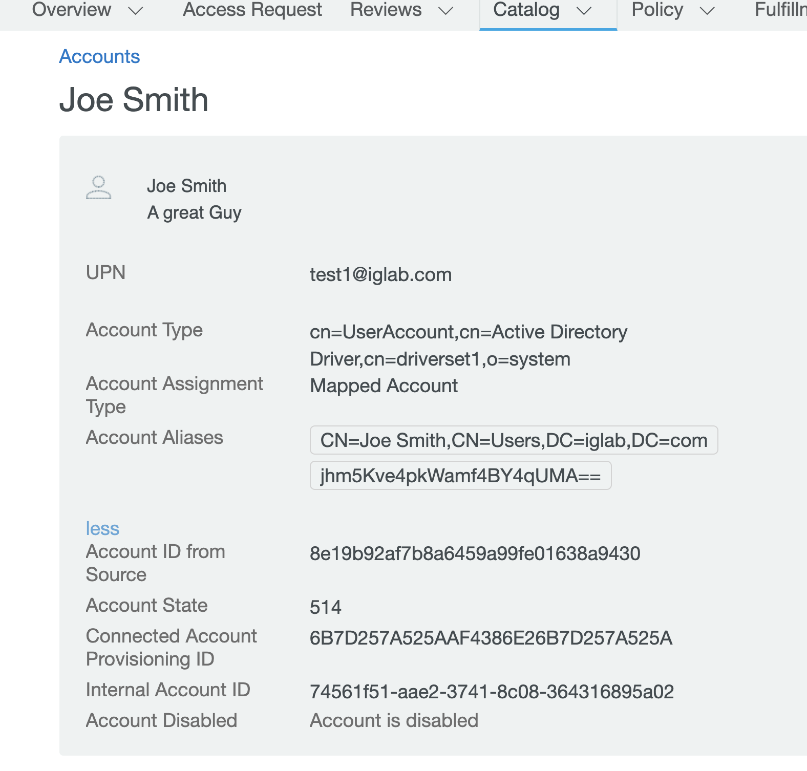

This example uses the stock AD driver with the Identity Governance Assignment collection package installed.

It brings back additional attributes on both the Accounts and the Groups. Note that there are custom attributes on the entities in IG that will need to be added.
These attributes can be added from the entity definitions in the export package.

The pic below shows the Owner attribute on the Group entity.

On the Accounts, you can see the Description, aliases, UPN, and Account State (userAccountControl) attributes. None of these are returned by the stock entitlement collector.

